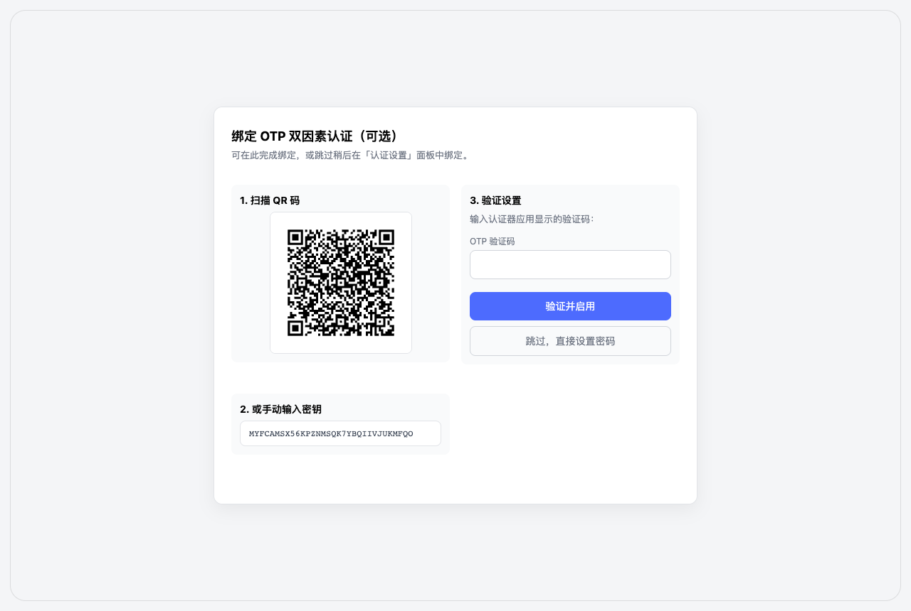
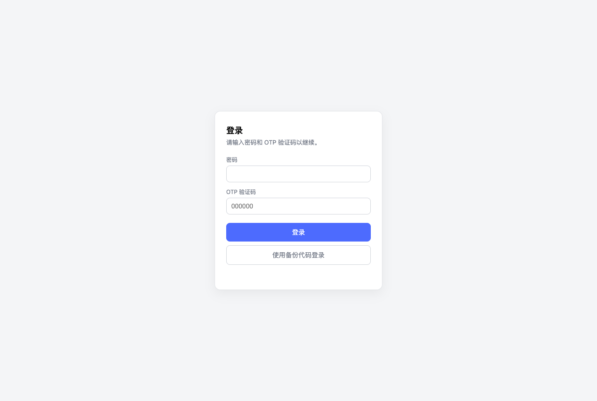
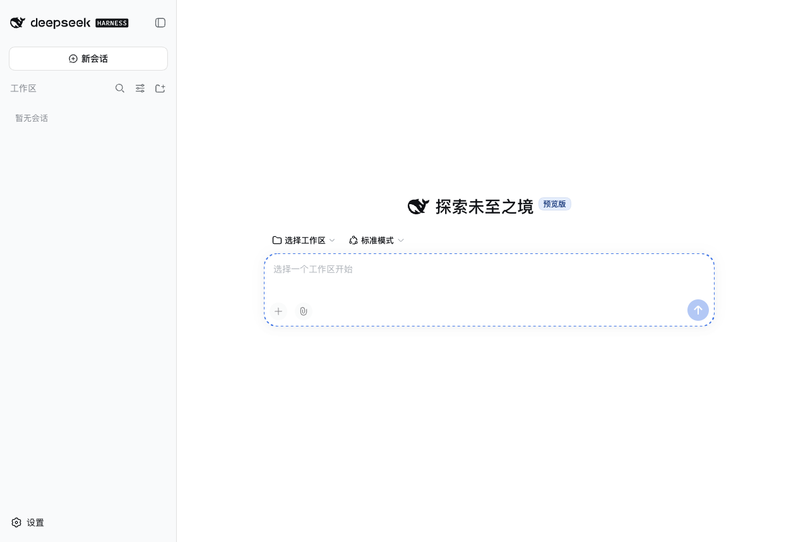
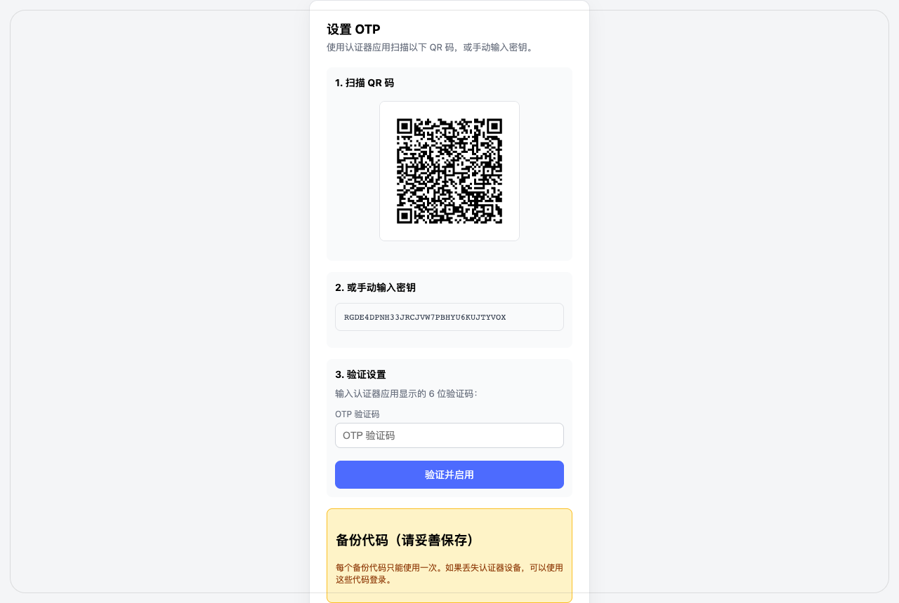
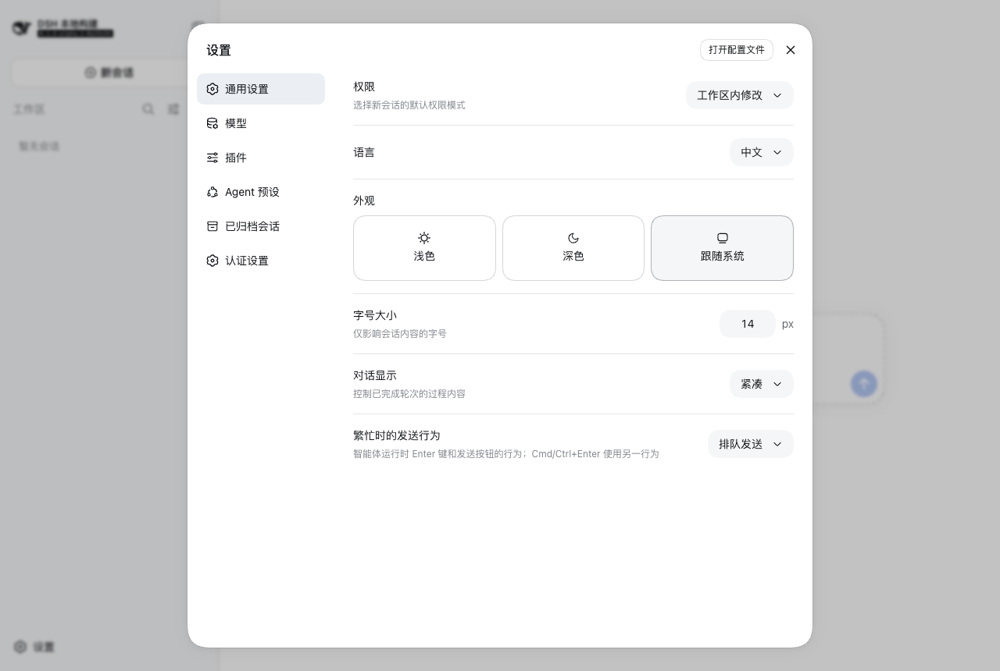
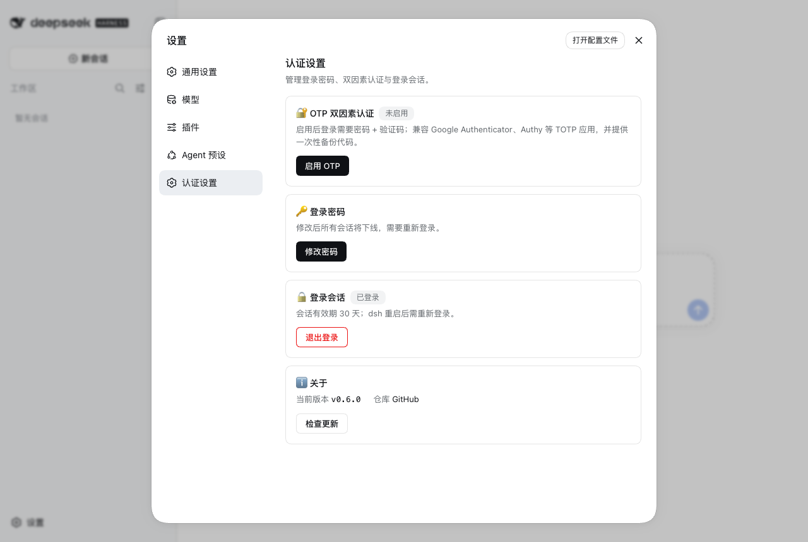

# dsh-auth-gateway

<p align="center">
  
</p>

<p align="center">
<a href="https://www.npmjs.com/package/dsh-auth-gateway"></a>
<a href="https://www.npmjs.com/package/dsh-auth-gateway"></a>
<a href="LICENSE"></a>
</p>

<p align="center"><b>Language: 简体中文 | <a href="README.en.md">English</a></b></p>

为 [DeepSeek Harness](https://github.com/deepseek-ai/deepseek-harness) Web 提供认证门禁的 Cordis 插件：**密码认证 + TOTP 双因素认证 + 多层防爆破 + 会话管理 + 登录审计**，并在网关层**真实拦截每一个请求**（HTTP 与 WebSocket），未认证流量无法触及后端。

`dsh web` 本身没有任何认证层；配置平面（settings/credentials RPC）被 dsh 钉死在 loopback——官方注释写道"直到真实认证层存在"（until a real authentication layer exists），但从未实现或指定方案。本插件以进程内网关形态自行承担该角色补齐认证面：对外端口由网关独占，内部 webserver 由 bundle patch 钉在回环地址，网关是唯一入口。

本项目已支持最新的 dsh 0.1.2-rc.1 版本。dsh 0.1.2 起内部 webserver 新增了内置浏览器认证（BrowserAuth）：网关经官方 `credentials` 服务读取 upstream 会话密钥，为回环转发自动铸造 upstream cookie，对浏览器与部署方式透明（机制详见 [docs/zh/SECURITY.md](docs/zh/SECURITY.md)）。

## 安装和卸载

```bash
# 安装（从 npm registry）
dsh plugin --profile web add dsh-auth-gateway

# 启动（对外端口 8080，内部 webserver 自动挪到 8081）
dsh web --port 8080

# 卸载（先清凭据，再移除插件）
~/.dsh/profiles/web/node_modules/.bin/dsh-auth-gateway-uninstall
dsh plugin --profile web remove dsh-auth-gateway
```

- 支持从 GitHub / 本地目录安装，见 [docs/zh/INSTALL.md](docs/zh/INSTALL.md)；
- 忘记密码用 `dsh-auth-gateway-reset` 重置（重启后控制台打印新初始密码）；
- 部署指南：[docs/zh/DEPLOYMENT.md](docs/zh/DEPLOYMENT.md)

## 功能特性

- **密码认证**：首次部署自动生成初始密码（控制台打印，一次性），登录后引导设置个人密码（scrypt 哈希存储），之后每次访问需登录；
- **双因素认证（TOTP）**：可选启用，兼容 Google Authenticator、Authy、1Password 等主流认证器；含一次性备份代码（scrypt 哈希存储、单次使用），设备丢失时可恢复访问；**OTP 密钥以 AES-256-GCM 加密存储**（主密钥来自环境变量 `DSH_AUTH_GATEWAY_MASTER_KEY` 或自动生成的 `auth-gateway/otp-master.key`），磁盘泄露不再直接暴露第二因素根密钥；
- **真实请求拦截**：未认证 `/api/*` 返回 401、页面类路径 302 到登录页、WebSocket 升级直接拒绝；认证通过后请求透明转发（Host/Origin 规范化，兼容内部 trust fence）；
- **登录审计**：登录成功 / 失败 / 登出 / 改密与暴力破解告警（锁定/限流）均输出审计日志（`ctx.logger.info`/`warn`，含来源 IP 与失败原因，不记录任何凭据），并**持久化落盘** `$DSH_HOME/auth-gateway/audit.log`（JSONL，按天轮转、保留 90 天），形成完整可审计闭环；
- **多层防爆破**：密码失败按来源锁定（默认 5 次/5 分钟）+ 全局速率限制（默认 60 次/分钟）+ OTP/备份码独立限流（默认 10 次/分钟），scrypt 在 libuv 线程池异步执行，登录洪峰不阻塞事件循环；
- **会话管理**：内存 256-bit token（30 天），HttpOnly + SameSite=Strict Cookie，修改密码/禁用 OTP 吊销全部会话；
- **合规形态**：host-only 插件（零构建、零运行时依赖）+ 可选 client 半（设置面板，源码构建），主体全部经 dsh 官方扩展点（`ctx.effect`、`webServer.tapIndex`、`ctx.slots`）；唯有一项记录在案的安全例外——LAN trust（为域名/反代访问下模型设置页可用而对 connection 注册做最小介入，见 [TROUBLESHOOTING §1](docs/zh/TROUBLESHOOTING.md)）。

## 工作原理

```
浏览器 ──> dsh-auth-gateway 网关（对外端口，运行在 dsh 进程内）
               │  每个请求先过认证检查（会话表 O(1)）
               ├─ 未认证 ─> /api/*: 401 ｜ 页面: 302 /login ｜ WS: 拒绝
               ├─ 未通过 2FA ─> /otp/verify
               └─ 已认证 ─> 转发（Host/Origin 改写为回环）──> dsh webserver（127.0.0.1:内部端口）
```

- 网关生命周期与 dsh 绑定：随 dsh 启动/退出，无独立进程；
- bundle patch 将 webserver 移到回环端口（对外 = `--port`，内部 = 对外 + 1），远程无法绕过网关直连后端；
- 网关在 DSH 的 `__ModuleLoader__` 加载 connection 模块时、Settings 等消费者启动前建立客户端 loopback trust——这是**唯一记录在案的安全例外**（仅拦截 connection 注册，其他插件原样通过）；该兼容层不替代登录、HTTP/WebSocket 门禁或服务端 fence，详见 [TROUBLESHOOTING §1](docs/zh/TROUBLESHOOTING.md)；
- 认证状态机：`首次部署 → 初始密码登录 → 引导（设置个人密码）→ 登录 →（可选）OTP 验证 → 会话`；未完成引导或 2FA 的会话仅能访问对应验证端点。

## 界面预览

<table>
<tr>
<td align="center"><br/>引导页（初始密码登录后）</td>
<td align="center"><br/>登录（含 2FA 验证码）</td>
</tr>
<tr>
<td align="center"><br/>2FA 登录成功</td>
<td align="center"><br/>OTP 设置（QR 码）</td>
</tr>
<tr>
<td align="center"><br/>设置菜单（含"认证设置"入口）</td>
<td align="center"><br/>认证设置面板</td>
</tr>
</table>

## 快速开始

1. 启动 `dsh web`：首次部署自动生成**初始密码**并打印在控制台（醒目提示块）；请复制备用；
2. 打开 Web UI，用初始密码登录——将进入**引导页**：设置你自己的访问密码（至少 8 位，包含大小写字母或特殊字符；**强制**，设置完成前所有功能不可用）；初始密码为一次性凭据，设置后自动失效；
3. 登录后可访问 `/otp/setup` 启用 TOTP（扫码或手动输入密钥，输入验证码确认；同时生成备份代码请妥善保存）；
4. 已启用 OTP 后，登录需密码 + 验证码（或备份代码）；
5. 修改密码：访问 `/login`（已登录时显示改密表单），或经"认证设置"面板。

## 配置

以下字段为 bundle patch / profile patch 中 `dsh-auth-gateway` 行的 `config`（Standard Schema 校验）：

| 字段 | 默认 | 含义 |
|---|---|---|
| `listenHost` / `listenPort` | `0.0.0.0` / `3080` | 网关对外监听地址与端口 |
| `upstreamHost` / `upstreamPort` | `127.0.0.1` / `3081` | 内部 webserver 地址与端口 |
| `basePath` | `/` | 反向代理子路径前缀（如 `/dsh`）；**默认 `/`（根路径）**。子路径部署时在**部署方 profile patch** 中配置，不随插件分发 |
| `minPasswordLength` | `8` | 密码最小长度（4–128） |
| `requireMixedCase` / `requireSpecial` | `true` / `true` | 密码复杂度：大小写混合或特殊字符二选一满足 |
| `maxLoginFailures` / `lockMinutes` | `5` / `5` | 密码失败锁定阈值与时长 |
| `maxGlobalAuthAttemptsPerMinute` | `60` | 全局登录尝试速率上限 |
| `maxOtpAttemptsPerMinute` | `10` | 单来源 OTP/备份码验证速率上限 |
| `otpEnabled`（已废弃） | `false` | 不再作为启用开关——2FA 由用户登录后在「认证设置」中绑定激活；字段保留仅为兼容旧配置 |
| `otpRequired` | `false` | 2FA 激活后强制每次登录验证（无需任何配置） |
| `otpIssuer` / `otpPeriod` / `otpDigits` / `otpWindow` | `dsh-auth-gateway` / `30` / `6` / `1` | TOTP 参数（显示名、周期、位数、窗口） |
| `backupCodeCount` / `backupCodeLength` | `10` / `8` | 备份代码数量与长度 |

## 安全模型

认证状态变更（启用/禁用 OTP、修改密码）均要求完整验证：2FA 激活时禁用 OTP 需当前密码 + 验证码或备份代码；未完成 2FA 的会话不能访问敏感端点。OTP 验证防重放（记录已接受时间步）、防伪造（`x-forwarded-for` 不计入来源）。**OTP 密钥在落盘前以 AES-256-GCM 密封**，读取需主密钥——默认自动生成 `auth-gateway/otp-master.key`（0600），也可经环境变量 `DSH_AUTH_GATEWAY_MASTER_KEY`（hex/base64，32 字节）注入以隔离磁盘泄露。登录审计只记录事件种类、来源 IP 与失败原因，不落任何凭据。完整威胁模型、已知限制与恢复路径见 [docs/zh/SECURITY.md](docs/zh/SECURITY.md)。

## 文档

| 文档 | 内容 |
|---|---|
| [docs/zh/INSTALL.md](docs/zh/INSTALL.md)（[English](docs/en/INSTALL.md)） | 安装、更新、卸载、凭据重置的完整操作步骤 |
| [docs/zh/NGINX-DEPLOYMENT.md](docs/zh/NGINX-DEPLOYMENT.md)（[English](docs/en/NGINX-DEPLOYMENT.md)） | 配合 nginx 部署：裸金属直连 / 子域名 / 子路径 / Docker nginx 容器四种拓扑与配置示例 |
| [docs/zh/SECURITY.md](docs/zh/SECURITY.md)（[English](docs/en/SECURITY.md)） | 威胁模型、OTP 安全设计、已知限制与恢复路径 |
| [docs/zh/DEPLOYMENT.md](docs/zh/DEPLOYMENT.md)（[English](docs/en/DEPLOYMENT.md)） | 端口与监听、LAN 部署、HTTPS 建议、nginx 反向代理、故障排查 |
| [docs/zh/TROUBLESHOOTING.md](docs/zh/TROUBLESHOOTING.md)（[English](docs/en/TROUBLESHOOTING.md)） | 实机故障案例：域名下模型页不可用、原生依赖构建被拦、bundle 加载失败、版本线凭据格式、跨境超时优化 |
| [docs/zh/TESTING.md](docs/zh/TESTING.md)（[English](docs/en/TESTING.md)） | 单元测试、端到端（Playwright）、API/WebSocket 门禁验证 |
| [docs/DEVELOPMENT.md](docs/zh/DEVELOPMENT.md)（[English](docs/en/DEVELOPMENT.md)） | 架构说明、构建、开发统计 |

## 致谢

- **@adra2n** — 实现 OTP 双因素认证（[PR #1](https://github.com/xbzbing/dsh-auth-gateway/pull/1)），并添加 OTP 密钥 AES-256-GCM 静态加密存储与解密路径错误分类（[PR #6](https://github.com/xbzbing/dsh-auth-gateway/pull/6)）；
- **@meowtech** — 报告并初步实现了 dsh 新版本（rc8+ 配置平面收归 loopback）下 LAN 浏览器设置不可用问题的修复（[PR #7](https://github.com/xbzbing/dsh-auth-gateway/pull/7)）；该实现（loader 包装 + provide 劫持）随后被证实会破坏共存插件，本仓库已改用最小介入方案重写。

## 验证概览

- 单元与契约测试：`npm test`（覆盖 basePath 路由/重定向/转发、PWA 元数据放行、登录审计、审计日志轮转/清理、OTP 安全回归、client 契约、patch 端口推导）
- 部署流水线：`npm run deploy`（语法检查 → 全量测试 → 同步到 DSH 安装目录 → 安装后验证）
- 实机端到端：`node scripts/e2e.mjs`（Playwright，登录/2FA/改密全流程）
- 门禁验证：`./scripts/verify.sh`（curl，401/302/WS 拒绝/锁定）

详见 [docs/zh/TESTING.md](docs/zh/TESTING.md)。

## Model Experience

None，本包是浏览器与内部 dsh webserver 之间的认证载体，不会进入任何模型请求。

#### KV Cache effect

None；本包既不组装也不发送 provider 请求。

## License

MIT
